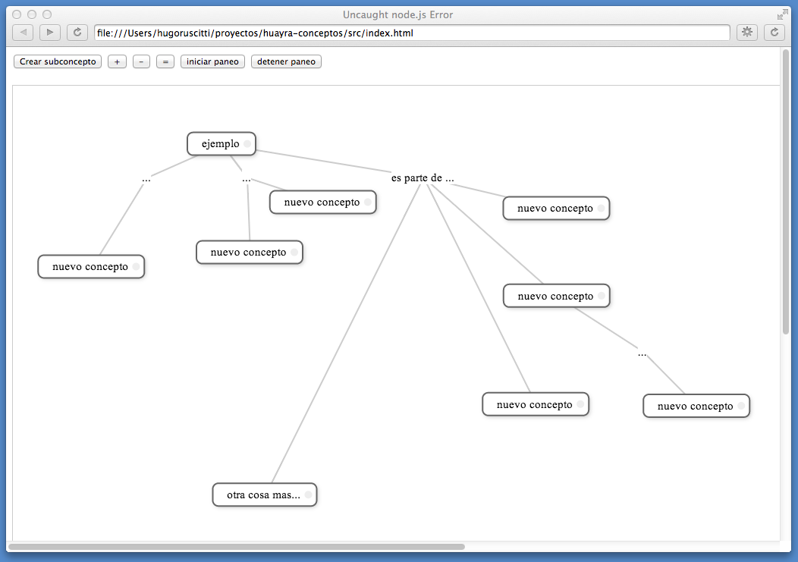

huayra-conceptos
================

Este repositorio contiene una prueba de concepto: una aplicación
para crear mapas conceptuales:

Los mapas conceptuales tienen mucho potencial como herramientas para
aprender nuevos conceptos, estudiar, diseñar y generar nuevas ideas; puede
ser útil como herramienta para llevar a las escuelas.

Te recomiendo un paper que habla sobre el transfondo teórico de los mapas conceptuales:

- http://cmap.ihmc.us/publications/researchpapers/theorycmaps/theoryunderlyingconceptmaps.htm

También hay una introducción mucho más sencilla de leer en esta web:

- http://www.inspiration.com/visual-learning/concept-mapping

y varios mapas conceptuales de ejemplo realizados en escuelas:

- http://www.inspiration.com/inspiration-thinking-and-planning-examples
- 

Instrucciones para ejecutar la aplicación
-----------------------------------------

Si tenés huayra en tu equipo, podés usar la aplicación
realizando estos 3 comandos desde un terminal:

    git clone https://github.com/hugoruscitti/huayra-conceptos.git
    cd huayra-conceptos
    nw src

En otros sistemas tendrías que bajar
[node-webkit](https://github.com/rogerwang/node-webkit) e integrarlo
a la aplicación.
